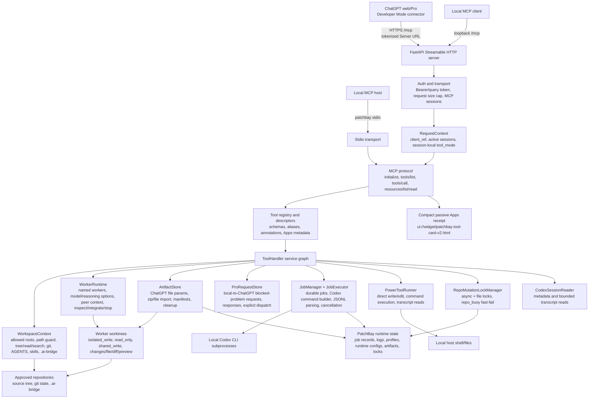

# Hybrid Architecture

## Product Identity

`patchbay` is the release repository for PatchBay: a local MCP control plane that routes ChatGPT context into local Codex execution.

The product is powerful because it lets ChatGPT web/Pro, Projects, memory, and active conversations drive local Codex workers without turning the human into a copy-paste bridge. ChatGPT keeps the high-level conversation, product context, generated files, and coordination loop. Local Codex keeps the repository, git state, toolchain, credentials, and execution environment.

The intended ChatGPT role is manager of local Codex workers, not primary file reader for broad work. Direct read/search/git tools stay available for orientation, briefing context, focused verification, exact line/diff checks, worker evidence review, and tiny exceptions, but non-trivial repository investigation, implementation, review, and synthesis should be delegated to named workers. A multi-worker configuration is part of the product value: ChatGPT can coordinate investigators, implementers, reviewers, verification workers, and synthesis workers through natural language.

The intended user experience is:

1. Start one local application.
2. Connect ChatGPT web/Pro through Developer Mode or an Apps-compatible MCP connector.
3. Open an allowed local workspace.
4. Load repository context, AGENTS instructions, selected files, skills, git status, and diffs.
5. Import ChatGPT-generated files or zips as local worker context when needed.
6. Read and answer local-to-ChatGPT Pro Escalation requests when local Codex needs Pro-level guidance.
7. Delegate investigations or isolated implementation work to named Codex workers and continue them by human name after restart.
8. Pass reports, changed-file context, and diffs between workers.
9. Inspect job status, results, changed files, diffs, and integration previews from ChatGPT.
10. Apply accepted worker output without automatic commits.
11. Optionally enable direct workspace tools such as edit, bash, or session transcript reads behind explicit power-mode controls.

The product is not trying to preserve either current architecture for its own sake. PatchBay repository remains the final application because that is the desired release target.

## Runtime Decision

The recommended architecture is Python/FastAPI first, with useful connector and workspace ideas ported into PatchBay rather than run as a permanent TypeScript sidecar.

Reasons:

- PatchBay already owns the most valuable execution boundary: async Codex jobs, isolated apply worktrees, result inspection, diff APIs, and environment restriction.
- CodexPro's most useful systems are mostly product and connector systems: setup flow, ChatGPT metadata, workspace context, path guarding, `.ai-bridge`, auth/tunnel handling, and optional UI resources.
- A permanent Node sidecar doubles process supervision, logging policy, package management, auth review, and failure modes.
- Porting CodexPro's concepts into PatchBay gives one public MCP server and one policy layer.

A temporary Node sidecar is acceptable only for a fast ChatGPT Apps widget prototype if Python MCP resource support becomes the blocker.

## Component Model

The important boundary is not one monolithic "wrapper." PatchBay is a set of cooperating runtime services behind one MCP endpoint:

- transport/auth/session handling in `patchbay.server`;
- public protocol and ChatGPT-visible tool descriptors in `patchbay.protocol`;
- workspace orientation and `.ai-bridge` context in `patchbay.workspace`;
- durable jobs and Codex subprocess execution in `patchbay.jobs`;
- named worker orchestration in `patchbay.workers`;
- ChatGPT file/zip import in `patchbay.artifacts`;
- local-to-ChatGPT Pro Escalation requests in `patchbay.pro_requests`;
- direct power tools in `patchbay.tools`;
- runtime profiles, status files, artifacts, and locks under `PATCHBAY_HOME` or `~/.patchbay`.

## Public MCP Boundary

The public boundary must remain explicit. Tools are registered from a typed registry, not discovered from handler functions.

Each public tool needs:

- stable name;
- "Use this when..." description optimized for ChatGPT;
- JSON input schema;
- output shape or documented structured content;
- `annotations.readOnlyHint`;
- `annotations.destructiveHint`;
- `annotations.openWorldHint`;
- `_meta.securitySchemes` mirrored for ChatGPT compatibility;
- no short invocation labels or output template URI by default;
- optional `app.tool_cards: true` mode can advertise the shared ChatGPT tool-card resource.

Developer Mode treats tools without `readOnlyHint` as write actions, so missing annotations are product bugs.

## Tool Tiers

### Tier 1: Core Codex Jobs

Low-level tools for explicit job/session control:

- `codex_plan_job`
- `codex_apply_job`
- `codex_get_status`
- `codex_get_result`
- `codex_get_diff`
- `codex_review`
- `codex_list_sessions`
- `codex_resume`
- `codex_interactive`
- `codex_interactive_reply`
- `codex_get_config`

These remain available for compatibility and power-user control. The normal ChatGPT-first path should prefer the worker facade when the user wants durable named local Codex colleagues. Current validation records Codex CLI `0.153.4` for this branch; older compatibility evidence used `0.144.1`. JSONL results are parsed from `item.completed` / `agent_message` events into structured job output.

`codex_resume`, `codex_interactive`, and `codex_interactive_reply` are async job starters classified as mutating/open-world in the public descriptors because they can continue sessions that write locally or call Codex externally. `codex_plan_job` remains locally read-only, but is not idempotent because it creates job state and can invoke Codex.

`codex_list_sessions` is metadata-only: it returns bounded known session ids from durable PatchBay job records plus configured Codex-home session roots. It merges and deduplicates those sources by session id, does not read transcript bodies, and does not return repo paths or session source paths.

`codex_read_session` is the explicit transcript power mode. It is advertised only when the active runtime profile enables transcript reads; when enabled it reads only bounded Codex session JSONL messages, redacts likely secrets, and does not return local session source paths.

### Tier 2: Worker-First Delegation

Preferred tools for ChatGPT-driven Codex work:

- `codex_worker_options`
- `codex_worker_inbox`
- `codex_worker_start`
- `codex_worker_message`
- `codex_worker_list`
- `codex_worker_inspect`
- `codex_worker_integrate`
- `codex_worker_stop`

These let ChatGPT use its current conversation/project context to brief named local Codex workers, attach generated files or zips, pass reports between workers, inspect diffs, and apply accepted results without asking the user to manage backend job ids, session ids, branch names, or worktree paths. Worker result parsing now expects more than a high-level summary: Codex structured output includes `detailed_report`, concrete `evidence`, `risks`, and `open_questions`, and the public worker report renderer surfaces those fields so ChatGPT can manage from reports instead of falling back to manual file reading.

### Tier 2B: Pro Escalation Requests

Reverse-handoff tools for local blocked problems that need ChatGPT Pro:

- `codex_pro_request_list`
- `codex_pro_request_read`
- `codex_pro_request_claim`
- `codex_pro_request_respond`
- `codex_pro_request_dispatch`
- `codex_pro_request_close`

These keep the answer lifecycle explicit. `respond` stores ChatGPT Pro's answer only. `dispatch` is the separate operation that may message an idle origin worker or start a new isolated worker. Dispatch does not integrate worker output and does not commit. Missing or busy origin workers return `dispatch_blocked`; PatchBay does not silently queue Pro responses.

### Tier 3: Workspace Context

Read-only tools ported from CodexPro concepts:

- `codex_open_workspace`
- `codex_repo_tree`
- `codex_search_repo`
- `codex_read_file`
- `codex_load_context`
- `codex_export_context`
- `codex_list_skills`
- `codex_load_skill`

These make ChatGPT useful before it starts a Codex job. They are bounded, redacted, and rooted in the active workspace.

### Tier 4: Handoff Artifacts

Controlled write tools limited to `.ai-bridge`:

- `codex_write_handoff`
- `codex_get_handoff_status`
- `codex_get_handoff_diff`

These bridge ChatGPT planning to local terminal execution without giving ChatGPT arbitrary write access to source files.

### Tier 5: Power Tools

Designed as first-class optional capabilities controlled by runtime configuration:

- direct file write/edit;
- safe bash;
- full bash;
- Codex session metadata;
- Codex session transcript reads;
- public tunnel mode, implemented as optional launcher-supervised child processes with token-gated HTTP.

Power tools are not "unsafe illusions"; they are product power. They must be controlled because broken control makes the tool less useful for real work.

## Worker Facade

The current product includes a natural-language worker facade over the existing runtime. Current behavior is summarized in [../worker-bridge/README.md](../worker-bridge/README.md), while the older package files in that directory remain implementation history.

The worker facade lets ChatGPT manage named local Codex workers through natural-language briefs and concise reports while PatchBay keeps exact runtime mechanics internal. A worker is derived from private metadata on durable job records, plus the Codex session reference already captured by the job runtime.

The worker facade provides:

- `codex_worker_inbox`;
- `codex_worker_start`;
- `codex_worker_message`;
- `codex_worker_list`;
- `codex_worker_status`;
- `codex_worker_inspect`;
- `codex_worker_integrate`;
- `codex_worker_stop`.

Hub V2 is the fleet form of the same natural-language architect bridge. It
exposes exactly 31 manager tools across fleet, durable work groups, complete
worker lifecycle, focused workspace inspection, Pro Requests, and operation
status. One non-trivial task is one durable group pinned to one machine;
parallel lanes and workers stay inside that group rather than routing
independently.

The artifact inbox lets ChatGPT import generated files or zips into PatchBay runtime storage, then attach artifact ids to isolated workers through `context_from_artifacts`. Imported artifacts are copied into `.ai-bridge/imported-artifacts/` inside the worker worktree as source material and excluded from changed-file reporting, diffs, integration preview, and apply.

Default `isolated_write` workers use durable external worktrees, same-session/same-worktree continuation after PatchBay restart, on-demand changed-file inspection, paged worker-file reads, one-file worker diffs, and explicit isolated workspace cleanup. Worker start/message calls can include bounded peer-worker report/change/diff context, and worker list returns compact `team_status` / `team_report` with scopes and filters for current work, same-conversation continuity, recent activity, full history, active, non-stopped, current-owner, or recently created workers. `codex_worker_status` is the pull-based manager status bar: active/quiet/stale/lost/completed/failed counts, deltas since the last status check for the same work run/conversation owner, suggested action, one short line per worker, hidden-history count, and polling guidance. Default `scope=current` shows the current work run plus live/problem workers instead of every historical completed worker; `scope=conversation`, `scope=recent`, and `scope=history` are explicit broader views. Unscoped list/status/wait calls cover all allowed repositories so a shared multi-repo server does not hide active workers behind the default workspace; `repo_path` deliberately narrows the manager view. Normal manager polling should wait about 20-30 seconds between status checks, and `codex_worker_wait` raises too-small waits to the configured minimum cadence; the returned cadence is a ChatGPT/operator UX hint, not a worker execution timeout. Worker stop is explicit interruption: live or recently started turns can require a second `force=true` confirmation through `workers.stop_confirmation_grace_seconds`, while liveness freshness and quiet windows remain display policy rather than hard task limits. Worker integration is preview-first: ChatGPT can inspect whether the worker patch applies, then explicitly apply the accepted result into the base checkout without committing. `include_untracked_from_base` copies selected accepted untracked base context into an isolated worker; unchanged copied context is excluded from integration patches, while modified copied context blocks automatic apply with `modified_included_untracked_base_files`. Job launch is owned by `JobExecutor`: background Codex turns are scheduled through executor-tracked asyncio tasks, subprocess metadata is recorded when launch succeeds, Codex JSON events are streamed to update session, heartbeat, event counts, stdout/stderr byte counters, current phase, command preview, and partial-note state while the process runs, and useful `agent_message` events are promoted into bounded manager-level checkpoints across supported item text/content shapes. Cancelled or timed-out turns preserve any captured partial report and checkpoints so an interrupted worker is not reduced to an empty "stopped" or "failed" state, and worker stop can briefly wait for captured artifacts to attach before returning. Persisted running jobs reload as recovered-running records and are reconciled only when neither the executor task nor the tracked subprocess nor a trusted live process pid is live after the grace window. Public report/status/diagnostics views separate worker answers from lifecycle debugging: routine report view omits low-level `latest_turn`, status view exposes liveness/turn diagnostics, and diagnostics view exposes the full bounded lifecycle payload. Result artifacts carry source metadata for Codex result events, latest-agent-message fallbacks, and raw-output fallbacks. Visible MCP `content` text for worker tools is compact while full data remains in `structuredContent`. Liveness thresholds are configurable display policy under `workers.heartbeat_fresh_seconds` and `workers.heartbeat_quiet_seconds`; status poll guidance is configurable under `workers.status_recommended_poll_seconds` and `workers.status_minimum_poll_seconds`; `codex_session_start_timeout_seconds` applies only before Codex creates a JSON session; `job_timeout_seconds` remains the optional whole-turn timeout. Codex auth/session startup is serialized per effective Codex home through an in-process gate plus host file lock, and spawned Codex CLI jobs receive `CODEX_HOME`, `HOME`, `XDG_CONFIG_HOME`, and `GIT_CONFIG_GLOBAL` so Codex, `gh`, git credential helpers, sessions, model menus, and CLI auth all resolve the same user state.

PatchBay treats authoritative Codex turn completion separately from CLI wrapper exit. After the exact session id is known, the executor observes that session's append-only JSONL for strict `task_complete` evidence. Stdout `turn.completed` is also persisted as a separate pre-terminal evidence envelope containing the latest bounded, redacted agent report; it does not choose terminal state until one final exact-session probe has had the chance to supply the stronger report. The first accepted source atomically persists terminal worker state and a manager-usable result before wrapper cleanup, then keeps the repository mutation lock until owned process cleanup is proven. The result artifact is an atomic secondary copy; the durable job record remains authority.

A small POSIX supervisor publishes a private cleanup proof only after its supported ownership mechanism proves no owned process remains. Linux uses child-subreaper and exact boot/start identities. Unprivileged macOS cannot prove an arbitrary marker-stripped rapid double-fork after the ancestry edge disappears; in that case PatchBay writes an explicit uncertainty record, leaves a low-cost sentinel holding the inherited repository lock, projects operator recovery instead of success, and never signals a recycled bare PID or silently unlocks the checkout. After semantic completion, the supervisor receives a bounded cleanup-proof window derived from its platform-specific discovery and quiescence algorithm before escalation, so host contention cannot destroy valid cleanup evidence; the completed report remains durable throughout that window. While cleanup is pending, the report remains readable but same-worker follow-up and integration are refused. Executor-task liveness, Codex-process liveness, and cleanup-only supervision are projected separately. Once durable cleanup conclusively proves a terminal turn inactive, routine liveness refresh reuses that proof instead of rediscovering the historical process tree every projection cycle. A missing cleanup outcome remains fail-closed but reuses its last conservative result between periodic discovery passes; pending or uncertain cleanup continues active reconciliation. Cleanup bounds do not impose a timeout on unfinished Codex work. Resume observation starts at a durable per-turn session offset, persisted running jobs recover first from exact-session evidence and then from validated stdout completion evidence, cancellation intent is published before the launch gate can open, and the first durable terminal decision is never reversed; later evidence is diagnostic only.

Hub Edge control loops are independently supervised. Heartbeat, worker projection, command claim, result outbox, and reconciliation can recover without taking down one another; one failing receipt or reconciliation record is backed off without starving later work. The private Edge journal preserves every attempt's immutable contract, while the outer transport authenticates with the Edge's current session contract during rolling upgrades. Managers never drive lease or reconciliation transitions themselves: they keep the original operation id and use `patchbay_operation_status`. Full worker projection snapshots preserve durable history without launching Git subprocesses per historical worker on every heartbeat: active workers sharing a base checkout reuse one change scan and HEAD read per snapshot, while fully terminal shared checkouts and stable terminal isolated worktrees reuse orientation summaries and the shared base HEAD until a new turn, explicit refresh, or Edge restart. Strict preflight, focused inspection, and integration independently read live authoritative state, so a cached historical summary is never integration proof. One malformed worker projection is isolated without suppressing the rest of the fleet snapshot. If a current projection is absent, focused inspect/message routing may use the durable fleet-worker identity scoped to the same group, machine, and generation while Edge remains authoritative. Compact loop health and projection revision are persisted and surfaced as safe fleet telemetry. Repeated identical control-loop failures keep bounded diagnostic history and suppress traceback amplification. Reconciliation memory is bounded by coalesced operation/attempt/fence identities and paged journal hydration; terminal acknowledged/manual-recovery attempts do not re-enter restart work. Hub MCP sessions and manager/group polling snapshots have explicit idle/cardinality bounds without limiting durable group history. A fresh machine heartbeat with an old projection is labeled `stale` instead of allowing old worker counts to masquerade as current state.

Report evidence has two channels. Writable workers may create durable report files or changed-file evidence in their worker workspace. Read-only workers keep the source checkout read-only and expose their evidence through PatchBay-managed structured results, partial reports, latest partial notes, and checkpoints under `report`, `latest_partial_note`, `report_artifacts`, and `latest_checkpoints`. ChatGPT should inspect those fields and `codex_worker_status` before deciding that a long-running read-only worker is stuck.

For shared MCP Server URLs, the runtime treats ownership as coordination rather than authentication. Tool mode is session-local, worker/artifact views include owner-relative coordination flags, the default token-scoped owner normally lets short-lived transport sessions from one copied connector URL continue the same workers, and ChatGPT-provided `_meta["openai/session"]` is hashed into `chatgpt_session_ref` for same-conversation correlation when available. PatchBay also tracks a separate `work_run_ref` by activity/idle gap so one ChatGPT conversation can have multiple work runs without default status becoming a historical archive. Legacy unscoped records are labeled as `legacy_connection` instead of being treated as proven foreign owners, cross-owner mutation requires explicit `takeover: true`, and Codex turns can queue behind the configured execution concurrency limit. Base-checkout mutation paths use per-repository locks that fail fast with `repo_busy` by default; an architect-selected `manager_controlled` group permits concurrent shared-write worker turns while leaving direct writes and integration serialized. `active_mcp_sessions` is transport-session churn and must not be interpreted as the worker ownership or conversation boundary. No separate worker database, mailbox, transcript copy, role system, automatic reviewer chain, automatic commit, or automatic merge/promotion flow exists. Future work can add optional app-server backend evaluation.

The worker bridge does not replace the security boundary. It should reuse the same typed registry, path guard, power-mode controls, auth policy, artifact caps, and redaction rules used by the current public surface.

Production Edge control loops share a bounded pool of persistent HTTP connections so idle claim, heartbeat, and projection exchanges reuse TLS state. A broken connection is discarded and surfaced to the owning loop without a hidden request retry, preserving the durable operation boundary when a response outcome is unknown. After process reconciliation, an unchanged job/liveness/Pro Request state token suppresses a duplicate full-history projection build and upload; heartbeat carries bounded projection counts rather than another copy of the full snapshot. Current-version job records also load without a redundant rewrite, while legacy records receive one redacting/normalizing migration write.

## Codex Execution Boundary

The execution boundary is organized around explicit services:

- `JobExecutor`: builds `codex exec` and resume commands with prompts sent through stdin, tracks subprocesses, cancellation, timeouts, JSONL parsing, diffs, and redacted artifacts.
- `JobManager`: durable job records, active-job admission, apply-job worktrees, worker worktree creation/removal, and persisted state.
- `WorkerRuntime`: job-derived worker identity, worker continuation, peer-worker context, artifact materialization, worktree inspection, integration preview, and accepted-result application.
- `ArtifactStore`: runtime-only ChatGPT file/zip imports, manifests, bounded inspection, workspace scoping, and materialization into isolated workers.
- `ProRequestStore`: runtime-only Pro Request manifests, reports, attachments, responses, ownership metadata, sanitized `.ai-bridge/pro-requests` mirrors, repo staleness checks, and explicit dispatch state.
- `RepoMutationLockManager`: per-repository async and file locks for base-checkout writes, direct command/write paths, shared-write workers, and integration.
- `WorkspaceContext`: repository orientation, path validation, AGENTS and skills, git state, `.ai-bridge`, and direct write/edit helpers.
- `PowerToolRunner`: configured direct command execution with timeout/output controls and optional session gating.

Generic `read`, `write`, `edit`, or `bash` handlers must enter this boundary only through the tool tier policy and current tool mode. Aliases are selection aids; they do not create separate execution paths.

## Workspace Context Layer

PatchBay's workspace layer provides:

- active workspace selection from configured allowed roots;
- optional canonical-to-local workspace aliases for remote copies or mounts;
- path guard with realpath checks and symlink escape rejection;
- blocked glob defaults for `.env`, private keys, `.git`, dependency/build output, cache folders, and configured secret paths;
- bounded tree listing;
- bounded file reads with binary and size detection;
- ripgrep-first search with safe fallback;
- git status, diff, and recent log summaries;
- AGENTS chain loading from repo root to target path;
- skill inventory and bounded `SKILL.md` loading by skill name;
- selected-file context bundle export.

The context layer is read-only except for `.ai-bridge` artifact writes and direct write/edit calls when the configured power mode exposes them.

## State And Artifacts

State should be separated by purpose:

- config: committed defaults and local overrides;
- profiles: user/workspace startup preferences and connection mode;
- job store: durable job records and process metadata;
- artifacts: bounded job outputs, diffs, and summaries;
- `.ai-bridge`: handoff and context artifacts inside the active repo;
- audit log: metadata-only events with correlation IDs.

Raw prompts, secrets, auth files, full Codex outputs, and local session transcripts must not be logged by default.

## Lineage And Attribution

CodexPro is MIT-licensed source material and product inspiration, not an upstream target, fork base, or contribution destination. PatchBay ports or rewrites useful ideas into one local MCP server and one policy layer. See [../../NOTICE](../../NOTICE) for attribution.

## Current Verification

Verified:

- local Streamable HTTP MCP startup and probing against disposable repos;
- real Codex CLI plan/job validation through MCP, with current local version recorded during each validation run;
- current Codex JSONL structured result parsing;
- token-gated auth and tunnel fail-closed behavior in automated tests;
- installable CLI entry points for `patchbay` and `patchbay-stdio`, with
  compatibility wrappers for legacy scripts;
- stdio MCP transport over the same protocol/tool runtime as Streamable HTTP;
- guided terminal setup output and JSON `setup_guide` for ChatGPT connector
  steps, profile reuse, token handling, and tunnel warnings;
- interactive setup, saved profile settings, explicit cloudflared install,
  ngrok/stable tunnel shortcuts, URL copy/open controls, and bounded tunnel
  failure hints;
- precise CodexPro-derived compatibility alias schemas with canonical handler
  translation and path-scoped `show_changes`;
- runtime-aware descriptor truthfulness for disabled direct write, bash, and
  transcript-read profiles while preserving the full-power catalog;
- direct tokenized public-tunnel MCP health, `initialize`, worker-mode `tools/list`, artifact inbox transfer, isolated worker artifact read, integration exclusion, and cleanup through ngrok;
- direct two-client MCP trial for session-local tool modes, shared worker inspection, cross-owner mutation refusal, explicit takeover, ownership transfer, and accepted-result integration;
- Hub V2 outside-in evaluation through real loopback TCP for both MCP managers
  and two Edge runners, including the exact 31-tool catalog, independent groups,
  aggregate batch status, same-worker continuation, integration-token recovery,
  result/reconciliation replay, restart persistence, and group closure;
- workspace path guards, blocked globs, symlink escape rejection, and default power-tool denial.

Not yet verified for release:

- real ChatGPT Developer Mode connection and natural tool selection;
- real ChatGPT-originated worker flows through a public tunnel from the actual UI;
- real ChatGPT-originated apply-job diff review;
- real ChatGPT-originated resume/interactive continuation.

## Remaining Architecture Work

The current hybrid implementation has the core ChatGPT-facing connector, installable CLI, stdio transport, guided setup output, workspace context, skill discovery/loading, `.ai-bridge` handoff, durable Codex jobs, resume/interactive job starters, precise compatibility alias metadata, runtime-aware descriptor filtering, token-gated tunnel startup, and reusable live MCP evals in place.

Remaining work is additive:

- complete the real ChatGPT UI release evals, including ChatGPT-originated token-gated tunnel paths when advertised;
- richer auth modes beyond tokenized local/tunnel use if this becomes multi-user;
- deeper schema coverage for future tools as they are added;
- interactive ChatGPT card actions beyond the current compact passive receipt, if real ChatGPT evidence shows they are useful;
- broader Codex CLI compatibility probes across installed versions;
- CORS policy only if a trusted standalone local UI is added.

## Sources Checked

- CodexPro source at upstream commit `03556103b3dc6de2e67e6e64835a72363c3a71a1`.
- CodexPro npm version `0.28.5`.
- PatchBay source files under `src/patchbay/`, including `server.py`,
  `protocol/mcp.py`, `tools/handler.py`, `jobs/manager.py`,
  `jobs/executor.py`, `security.py`, plus `config.yaml` and `tests/`.
- OpenAI Developer Mode docs: https://developers.openai.com/api/docs/guides/developer-mode
- OpenAI Apps SDK reference: https://developers.openai.com/apps-sdk/reference
- OpenAI Apps SDK auth docs: https://developers.openai.com/apps-sdk/build/auth
- OpenAI Apps SDK security/privacy docs: https://developers.openai.com/apps-sdk/guides/security-privacy

## Worker Integration

PatchBay supports explicit integration preview and accepted-result application for isolated writing workers. `codex_worker_inspect(view="integration_preview")` is read-only and reports whether a worker patch can apply to the base checkout. `codex_worker_integrate` is the explicit mutating act that applies the accepted worker result without committing and without deleting the worker worktree.
